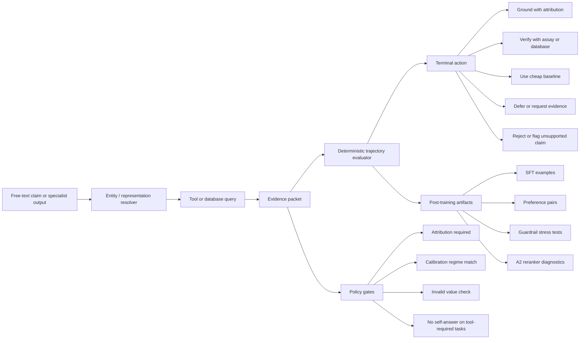

# Results Snapshot

This is the compact, public-facing result table used by the README and release
cards. It is intentionally limited to metrics that have been checked in the
current research release surface.

| Component | Baseline | Improved / checked | Interpretation |
|---|---:|---:|---|
| Evidence-rationale guardrail | 0.50 | 1.00 | Deterministic guardrail rescued 20 stress cases with 0 introduced failures. |
| A2 ambiguous band, SapBERT to SFT-1.5B | 0.750 | 0.875 | The open local reranker closes most of the ambiguous disease-resolution gap. |
| A2 proprietary reference | 0.750 | 0.900 | Claude-haiku remains above the open SFT reranker on de-leaked band_cases. |
| A2 GRPO, hard band_cases | 0.785 | 0.755 | From-base GRPO did not improve hard in-band disambiguation. |
| A2 GRPO, full band_eval | 0.402 | 0.710 | GRPO mainly learned the easier abstain gate. |
| Post-training data validator | issues present | issues none | Tracked artifacts pass schema and integrity validation. |

## Architecture

